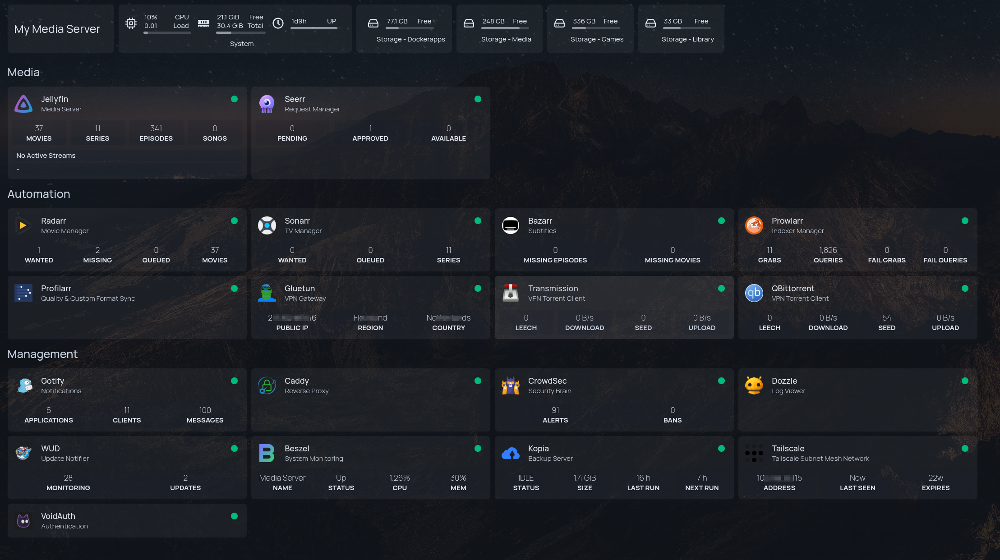
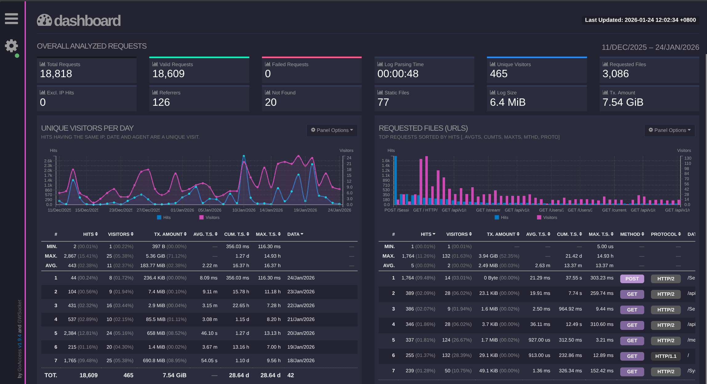
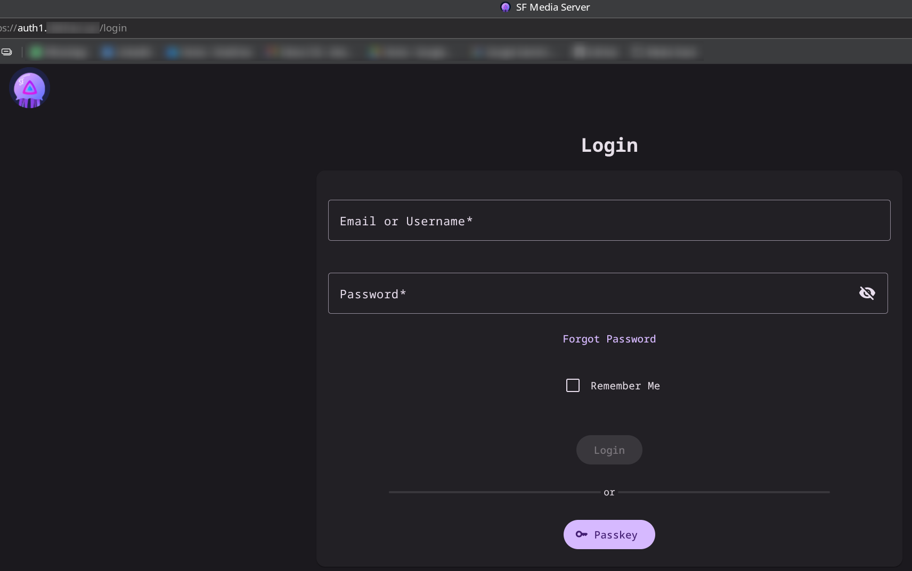
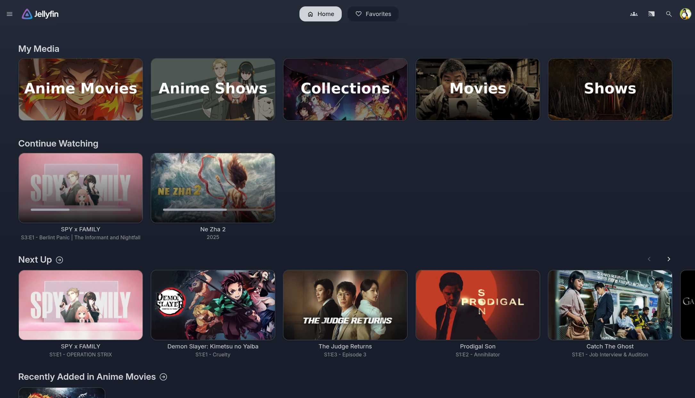
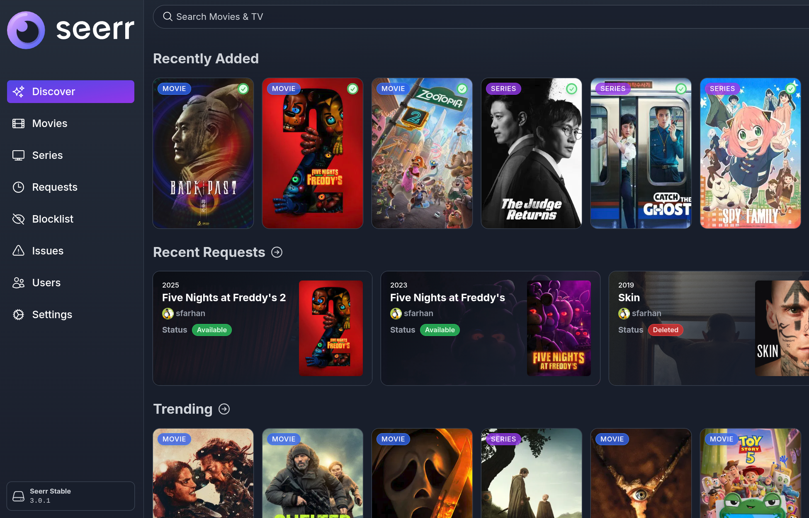
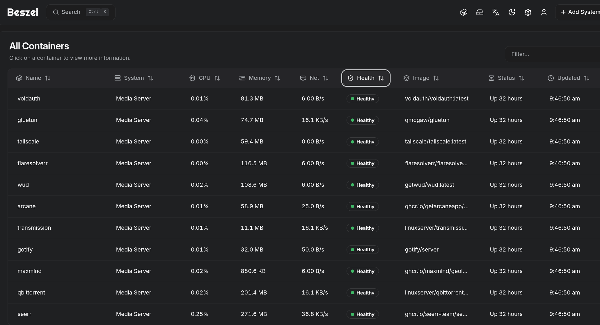

# 🐳 HomeLab Server & Services

-blue>)

> **"A modular, automated homelab, running a media server on Arch Linux (CachyOS), featuring a split-network security model and atomic-move storage."**

> **📚 FULL DOCUMENTATION:** Detailed deployment guides, network architecture, and security policies are hosted on the live wiki at **[docs.sfhomelab.com](https://docs.sfhomelab.com)**.

This repository strictly houses the Docker Compose stacks, environment templates, and automation scripts for the homelab infrastructure.

This is put together in Feb 2026, for the future me when I am ready to move what I have to a `always-on` homelab/server that I am putting together. And if it somehow helps others on their own journey, its awesome too!

---

## 🖥️ Current Hardware Specifications

| Component | Detail |
| --- | --- |
| **OS** | Daily Driver - CachyOS |
| **MOBO** | X870 Asrock Pro Rs |
| **CPU** | AMD Ryzen 5 7600X |
| **RAM** | 32GB DDR5 |
| **GPU** | Radeon RX 5600 XT (Transcoding) |
| **Storage** | 2x 1TB NVMe LVM Pool (`/mnt/pool01`) + 500GB Crucial SSD (`/mnt/CrucialBackup`)|
| **Network Card** | Marvell AQC113C 10GbE |

## Quick Navigation

| Category | Topic | Description |
| :--- | :--- | :--- |
| **🏗️ Global** | **[Deployment Guide](https://docs.sfhomelab.com/01-infra/deployment-guide.md)** | **Start Here.** Zero-to-Hero guide for host OS setup (Docker install, LVM, DNS, Firewall) |
| | **[Network Architecture](https://docs.sfhomelab.com/01-infra/networking.md)** | Explaining the `custom docker network` vs. `service:gluetun` split-tunnel design |
| | **[Storage & LVM](https://docs.sfhomelab.com/01-infra/storage.md)** | How the NVMe pool is aggregated and the "Atomic Move" logic |
| | **[Host Firewall](https://docs.sfhomelab.com/01-infra/security-firewall.md)** | The `firewalld` rules creating the "Software VLAN" to block LAN access |
| | **[Backups](https://docs.sfhomelab.com/01-infra/backups.md)** | Dockerapps Local Mirror/Rsync, Kopia x Cloudflare R2 & OS Rescuezilla |
| | **[Troubleshooting](https://docs.sfhomelab.com/01-infra/troubleshooting.md)** | "War Stories" log: Solving exit code 137, 401 healthchecks, and race conditions |
| **🛡️ Gateway** | **[Overview](https://docs.sfhomelab.com/02-gateway/index.md)** | Overview and Directory setup |
| | **[Caddy](https://docs.sfhomelab.com/02-gateway/caddy.md)** | Reverse proxy config, GeoIP filtering, and SSL hardening |
| | **[CrowdSec](https://docs.sfhomelab.com/02-gateway/crowdsec.md)** | IPS configuration, bouncer setup, and acquisition rules |
| | **[VoidAuth](https://docs.sfhomelab.com/02-gateway/voidauth.md)** | Identity provider setup |
| | **[Tailscale](https://docs.sfhomelab.com/02-gateway/tailscale.md)** | Setup for remote access |
| | **[Cloudflare DDNS](https://docs.sfhomelab.com/01-infra/cloudflare-setup.md)** | *Global Doc*: Managing DNS records and API tokens for the proxy. |
| **🍿 Media** | **[Overview](https://docs.sfhomelab.com/03-media/index.md)** | Overview on the Architecture setup |
| | **[Jellyfin & Seerr](https://docs.sfhomelab.com/03-media/jellyfin-stack.md)** | Setup, hardware transcoding (AMD GPU) and client connectivity |
| | **[The VPN & *Arr Stack](https://docs.sfhomelab.com/03-media/vpn-arr-automation-stack.md)** | Radarr/Sonarr setup, Prowlarr/Indexers, and Gluetun tunneling |
| | **[Custom Anime Profiles via Profilarr](https://docs.sfhomelab.com/03-media/profilarr-anime.md)** | Profilarr setup for Anime Grabs |
| | **[The "Atomic Move" Logic](https://docs.sfhomelab.com/03-media/bonus-info-story-mode.md)** | Technical deep-dive on how hardlinks work in this specific setup |
| **📊 Utilities** | **[Overview](https://docs.sfhomelab.com/04-utilities/index.md)** | Overview on the Architecture setup |
| | **[Monitoring Stack Overview](https://docs.sfhomelab.com/04-utilities/monitoring-stack.md)** | Overview on the Homepage, WUD, Dozzle behind Socket Proxy |
| | **[Beszel](https://docs.sfhomelab.com/04-utilities/beszel-setup.md)** | Setting up the lightweight agent and mapping LVM metrics. |
| | **[Kopia](https://docs.sfhomelab.com/04-utilities/kopia.md)** | Dedup snapshot strategy to Cloudflare R2. |
| | **[GoAccess](https://docs.sfhomelab.com/04-utilities/goaccess.md)** | Real-time visual web log analyzer for Caddy. |
| | **[Gotify](https://docs.sfhomelab.com/04-utilities/gotify.md)** | Self-hosted push notification setup. |
| **Scripts** | **[Pull-All Images](https://docs.sfhomelab.com/scripts/pull-all.txt)** | Auto-Pull all services' images |
| | **[Recreate-All](https://docs.sfhomelab.com/scripts/recreate-all.txt)** | Auto `docker compose up -d --force-recreate` for all |

## Architecture Highlights

#### The "Two-Zone" Security Model
We bypass the default Docker bridge to enforce strict isolation

* **Zone 1 (Trusted):** `172.20.0.0/24`. Static IPs/Internal apps talk here.
* **Zone 2 (VPN Bubble):** P2P clients (qBit/Transmission) have **zero** IP address. They utilize `network_mode: service:gluetun`, routing 100% of traffic through AirVPN (WireGuard)

#### "Atomic Moves" Filesystem
* **Concept:** Downloads and Media Library reside on the same LVM Logical Volume (`/mnt/pool01/media`)
* **Result:** Importing a 50GB file is **instant** and consumes **0 bytes** of extra space via Hardlinks

#### Media Automation
* **Pipeline:** Seerr (Request) → Radarr (Monitored) → Prowlarr (Search) → Gluetun-Qbit (Download) → Radarr (Import) | Bazaarr (Substitle) → Jellyfin (Stream) → Gotify (Notify)
* **Result:** A fully automated experience where content appears automatically after requesting.

#### Security
1.  **Kernel:** `Firewalld` drops all Docker-to-LAN traffic (Software VLAN).
2.  **Ingress:** Caddy handles SSL & GeoIP blocking (Singapore Only).
3.  **Behavior:** CrowdSec bans IPs showing aggressive behavior (brute force, scanners).
4.  **Identity:** VoidAuth enforces authentication for selected publicly exposed services/containers

## Tech Stack / Tools /Services

| Logo | Name | Description |
| :--- | :--- | :--- |
|  | **[CachyOS](https://cachyos.org/)** | **Base OS.** An Arch Linux-based distribution |
|  | **[Docker](https://www.docker.com/)** | **Runtime.** Containerization engine for isolating application services. |
|  | **[Caddy](https://caddyserver.com/)** | **Ingress.** Secure reverse proxy with automatic HTTPS and GeoIP filtering. |
|  | **[CrowdSec](https://www.crowdsec.net/)** | **Security.** Collaborative IPS detecting and blocking aggressive IP behaviors. |
|  | **[VoidAuth](https://github.com/void-auth/void)** | **Identity.** Lightweight OIDC provider handling Single Sign-On (SSO). |
|  | **[Gluetun](https://github.com/qdm12/gluetun)** | **VPN Tunnel.** AirVPN (WireGuard) client acting as a sidecar for secure downloads. |
|  | **[Tailscale](https://tailscale.com/)** | **Mesh Network.** Zero-config VPN for secure remote access and management. |
|  | **[Jellyfin](https://jellyfin.org/)** | **Media Server.** Streaming server. |
|  | **[Seerr](https://github.com/seerr-team/seerr)** | **Requests.** "Netflix-style" frontend for automated content discovery. |
|  | **[Radarr](https://radarr.video/)** | **Automation.** Movie collection manager and downloader integration. |
|  | **[Sonarr](https://sonarr.tv/)** | **Automation.** TV Series management and calendar automation. |
|  | **[Profilarr](https://github.com/Dictionarry-Hub/profilarr)** | **Management.** Synchronizes quality profiles across *Arr applications. |
|  | **[Prowlarr](https://prowlarr.com/)** | **Indexers.** Centralized management for Torrent trackers. |
|  | **[FlareSolverr](https://github.com/FlareSolverr/FlareSolverr)** | **Proxy.** Solves Cloudflare challenges to allow Prowlarr indexer access. |
|  | **[qBittorrent](https://www.qbittorrent.org/)** | **Downloader.** BitTorrent client routed through VPN. |
|  | **[Transmission](https://transmissionbt.com/)** | **Downloader.** BitTorrent client routed through VPN. |
|  | **[Beszel](https://github.com/henrygd/beszel)** | **Monitoring.** Lightweight agent tracking LVM, CPU, and Docker metrics. |
|  | **[Dozzle](https://github.com/amir20/dozzle)** | **Monitoring.** WebUI to monitor Docker logs. |
|  | **[WUD](https://github.com/getwud/wud)** | **Monitoring.** Watches and alerts for images updates. |
|  | **[Speedtest](https://github.com/alexjustesen/speedtest-tracker)** | **Monitoring.** Automated internet bandwidth and latency tracking. |
|  | **[Homepage](https://gethomepage.dev/)** | **Dashboard.** Central start page with live service widgets. |
|  | **[Kopia](https://kopia.io/)** | **Backup.** Dedup backups to Cloudflare R2. |
|  | **[GoAccess](https://goaccess.io/)** | **Analytics.** Real-time visual web log analyzer for Caddy. |
|  | **[Gotify](https://github.com/gotify)** | **Notifications** WebUI and Backend Server Notification tool. |
|  | **[Cloudflare](https://www.cloudflare.com/)** | **Network.** DNS management, DDNS updates, and Object Storage (R2). |

 

> **📚 FULL DOCUMENTATION:** Detailed deployment guides, network architecture, and security policies are hosted on the live wiki at **[docs.sfhomelab.com](https://docs.sfhomelab.com)**.

## 📸 Gallery

