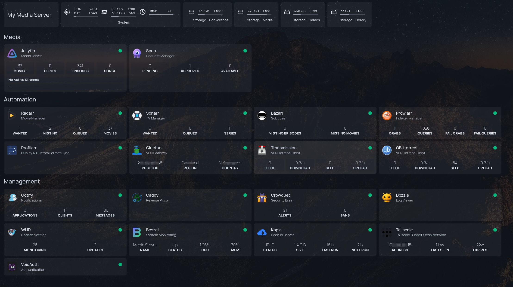
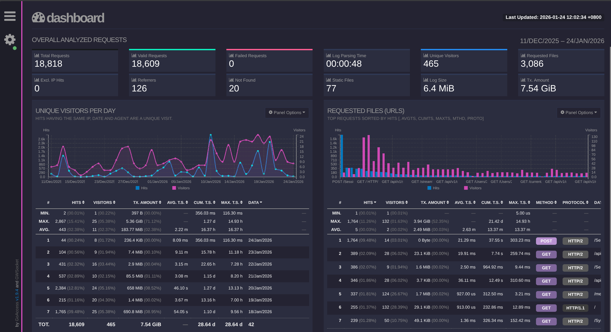
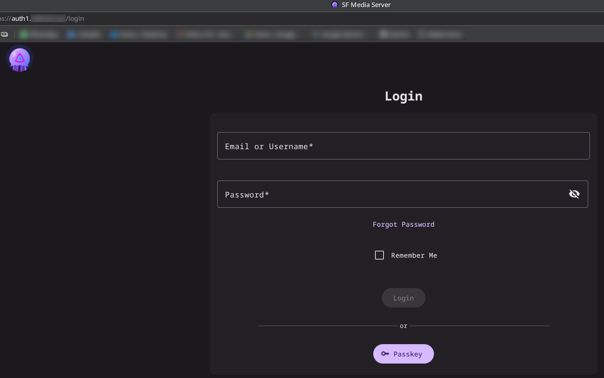
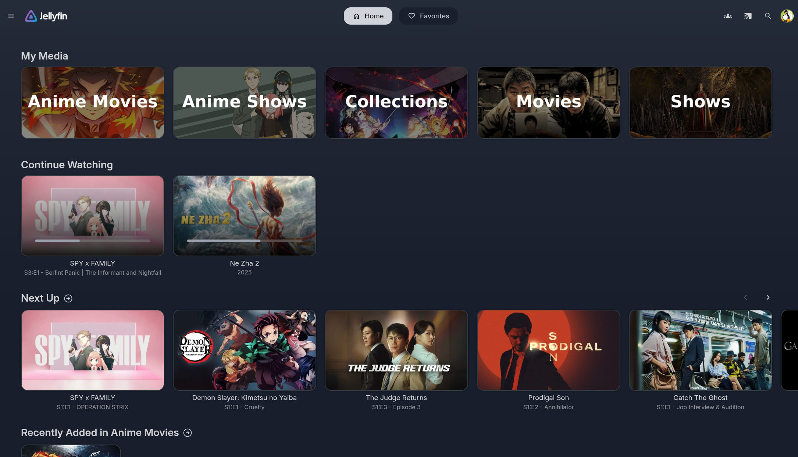
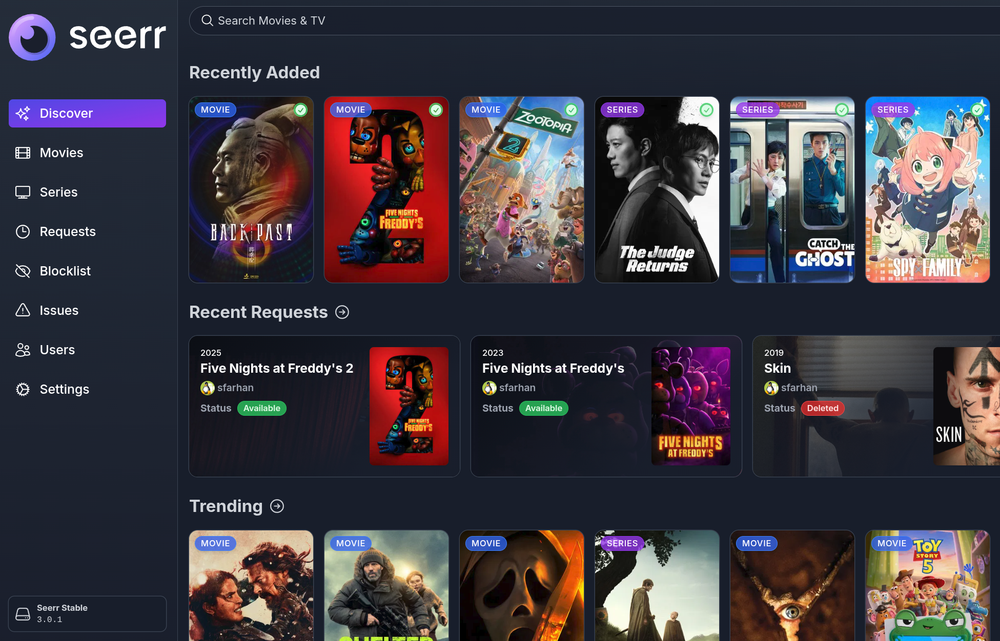
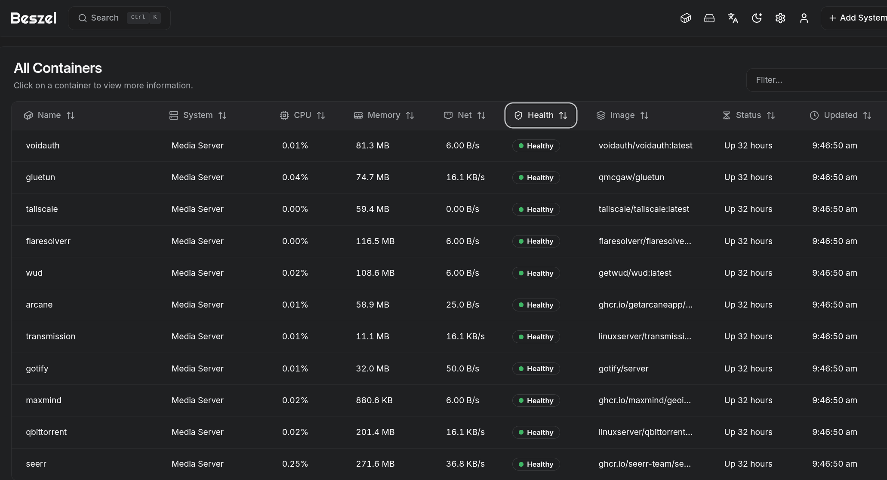

# 🐳 HomeLab Server & Services

-blue>)

> **"A modular, automated homelab, running a media server on Arch Linux (CachyOS)"**

> **📚 FULL DOCUMENTATION:** Detailed deployment guides, network architecture, and security policies are hosted on the live wiki at **[docs.sfhomelab.com](https://docs.sfhomelab.com)**.

This repository strictly houses the Docker Compose stacks, environment templates, and automation scripts for the homelab infrastructure, where it will be relatively easy for me to clone/pull when deploying similar stacks to a new machine.

This is put together in Feb 2026, for the future me when I am ready to move what I have to a `always-on` homelab/server that I am putting together. And if it somehow helps others on their own journey, its awesome too!

---

## 🖥️ Current Hardware Specifications

| Component | Detail |
| --- | --- |
| **OS** | Daily Driver - CachyOS |
| **MOBO** | X870 Asrock Pro Rs |
| **CPU** | AMD Ryzen 5 7600X |
| **RAM** | 32GB DDR5 |
| **GPU** | Radeon RX 5600 XT (Transcoding) |
| **Storage** | 2x 1TB NVMe + 2 x 2TB HDDs MergerFS Vault + 500GB Crucial SSD as "Scratch" Disk |
| **Network Card** | Marvell AQC113C 10GbE |

## Architecture Highlights for Media Server

### The "Two-Zone" Security Model
We bypass the default Docker bridge to enforce isolation.

* **Zone 1:** `172.20.0.0/24`. Static Docker IPs/Internal apps talk here.
* **Zone 2 (VPN Bubble):** P2P clients (qBit/Transmission) have **zero** IP address. They utilize `network_mode: service:gluetun`, routing 100% of traffic through AirVPN (WireGuard)

### Scratch Disk to Vault
* **Concept:** Downloads and unpacks hit a dedicated 500GB SSD to absorb heavy random I/O and prevent mechanical drive thrashing.
* **Result:** Finalized media is sequentially migrated to the unified 4TB MergerFS HDD Vault for long-term, buffer-free storage.

### Zero-Touch Automation
* **Pipeline:** Seerr (Request) → Radarr (Monitored) → Prowlarr (Search) → Gluetun-Qbit (Download) → Radarr (Import) | Bazaarr (Substitle) → Jellyfin (Stream) → Gotify (Notify)
* **Result:** A fully automated experience where content appears automatically after requesting.

### Defense-in-Depth
1.  **Kernel:** `Firewalld` drops all Docker-to-LAN traffic (Software VLAN).
2.  **Ingress:** Caddy handles SSL & GeoIP blocking (Singapore Only).
3.  **Behavior:** CrowdSec bans IPs showing aggressive behavior (brute force, scanners).
4.  **Identity:** VoidAuth enforces authentication for selected publicly exposed services/containers

---

## Tech Stack / Tools

| Logo | Name | Description |
| :--- | :--- | :--- |
|  | **[CachyOS](https://cachyos.org/)** | **Base OS.** An Arch Linux-based distribution |
|  | **[Docker](https://www.docker.com/)** | **Runtime.** Containerization engine for isolating application services. |
|  | **[Caddy](https://caddyserver.com/)** | **Ingress.** Secure reverse proxy with automatic HTTPS and GeoIP filtering. |
|  | **[CrowdSec](https://www.crowdsec.net/)** | **Security.** Collaborative IPS detecting and blocking aggressive IP behaviors. |
|  | **[VoidAuth](https://github.com/void-auth/void)** | **Identity.** Lightweight OIDC provider handling Single Sign-On (SSO). |
|  | **[Gluetun](https://github.com/qdm12/gluetun)** | **VPN Tunnel.** AirVPN (WireGuard) client acting as a sidecar for secure downloads. |
|  | **[Tailscale](https://tailscale.com/)** | **Mesh Network.** Remote access and Intra-Server Mesh Management. |
|  | **[Jellyfin](https://jellyfin.org/)** | **Media Server.** Streaming server. |
|  | **[Seerr](https://github.com/seerr-team/seerr)** | **Requests.** Frontend for automated content discovery. |
|  | **[Radarr](https://radarr.video/)** | **Automation.** Movie collection manager and downloader integration. |
|  | **[Sonarr](https://sonarr.tv/)** | **Automation.** TV Series management and calendar automation. |
|  | **[Profilarr](https://github.com/Dictionarry-Hub/profilarr)** | **Management.** Synchronizes quality profiles across *Arr applications. |
|  | **[Prowlarr](https://prowlarr.com/)** | **Indexers.** Centralized management for Torrent trackers. |
|  | **[FlareSolverr](https://github.com/FlareSolverr/FlareSolverr)** | **Proxy.** Solves Cloudflare challenges to allow Prowlarr indexer access. |
|  | **[qBittorrent](https://www.qbittorrent.org/)** | **Downloader.** BitTorrent client routed through VPN. |
|  | **[Transmission](https://transmissionbt.com/)** | **Downloader.** BitTorrent client routed through VPN. |
|  | **[Beszel](https://github.com/henrygd/beszel)** | **Monitoring.** Lightweight agent tracking LVM, CPU, and Docker metrics. |
|  | **[Dozzle](https://github.com/amir20/dozzle)** | **Monitoring.** WebUI to monitor Docker logs. |
|  | **[WUD](https://github.com/getwud/wud)** | **Monitoring.** Watches and alerts for images updates. |
|  | **[Speedtest](https://github.com/alexjustesen/speedtest-tracker)** | **Monitoring.** Automated internet bandwidth and latency tracking. |
|  | **[Homepage](https://gethomepage.dev/)** | **Dashboard.** Central start page with live service widgets. |
|  | **[Kopia](https://kopia.io/)** | **Backup.** Dedup backups to Cloudflare R2. |
|  | **[GoAccess](https://goaccess.io/)** | **Analytics.** Real-time visual web log analyzer for Caddy. |
|  | **[Gotify](https://github.com/gotify)** | **Notifications** WebUI and Backend Server Notification tool. |
|  | **[Cloudflare](https://www.cloudflare.com/)** | **Network.** DNS management, DDNS updates, and Object Storage (R2). |

 

**📚 FULL DOCUMENTATION:** Detailed deployment guides, network architecture, and security policies are hosted on the live wiki at **[docs.sfhomelab.com](https://docs.sfhomelab.com)**.

## 📸 Gallery

